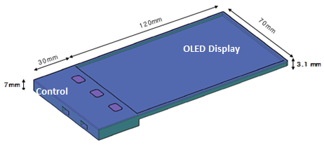

# NFT 하드월렛 플레이어 뷰어

### 차세대 차세대 휴대용 NFT 하드월렛 플레이어 & 뷰어

Wallet에서 관리하는 NFT는 Market에서 사고 팔 수 있는 재화의 형태로 보관된다. 일종의 게임 내 Inventory 기능을 담당하는 구조로 생각하면 쉽다. NFT 관리 페이지의 구성은 다음과 같다.

### 개요

* 디스플레이 개발(5.4인치 OLED 디스플레이 +도킹바 )&#x20;
* 안드로이드 OS 개발
* 펌웨어개발&#x20;
* 핵심키워드 THIN (얇은 디스플레이 뷰어)&#x20;
* 휴대용 ITEM 마이닝 시스템 탑재

### 스펙

1. OLED Display 4.97"\
   \- 1280 X 720 Real R.G.B\
   \- 16.7M Color\
   \- Touch panel\
   \- 120 X 70 X 3.1mm\

2. Main Control\
   \- 동영상및사진 재생기능    \
   \- 지문인식\
   \- 암호화 칩\
   \- Wifi 2.4Ghz, 5Ghz 및 Bluetooth 4.2\
   \- USB 2.0\
   \- 밧데리 내장

* 위 설계 및 스펙등은 개발 상황에 따라  다를 수 있습니다.         &#x20;

