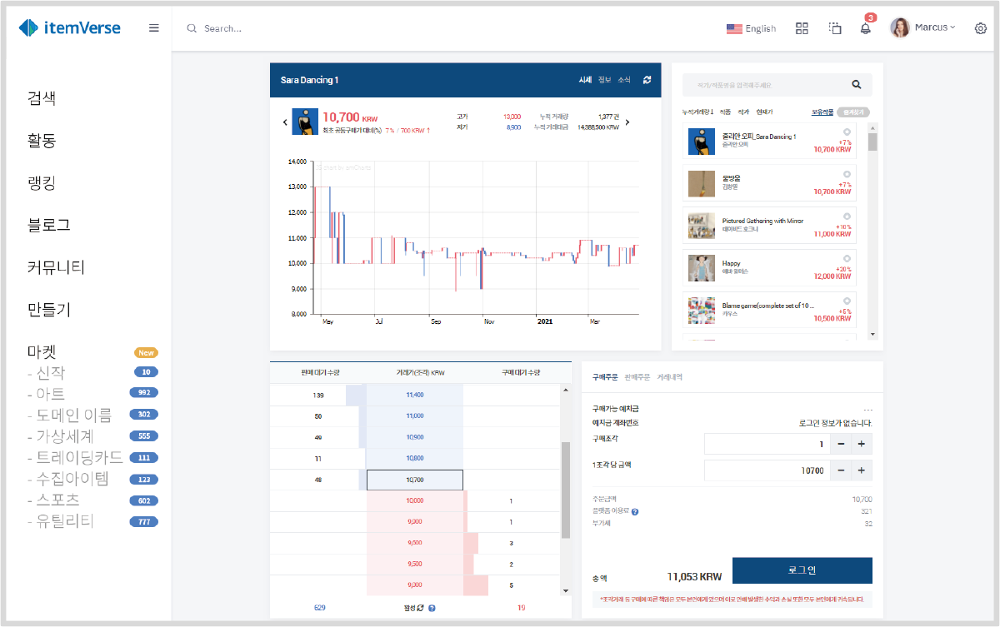

# NFT Market

## ItemVerse NFT Market

itemVerse NFT Market은 itemVerse의 NFT 자산 거래를 위한 System 역할을 하며 다음의 기능들을 갖는다.

* NFT 생성 및 관리, 허가&#x20;
* 사전판매 배너 관리&#x20;
* 마켓 거래품목 관리&#x20;
* Block data 및 Transaction data 관리 및 조회

Block data 및 Transaction data는 통계를 위한 정보로 활용된다. 투명하게 공개되는 Blockchain의 특성으로 인해 어떤 게임의 거래가 활발한지, 누가 어떤 NFT item을 보유하고 있는지 등을 알 수 있다.

이를 바탕으로 itemVerse는 게임 개발사 또는 운영사들에게 유의미한 정보를 전달할 수 있다.

