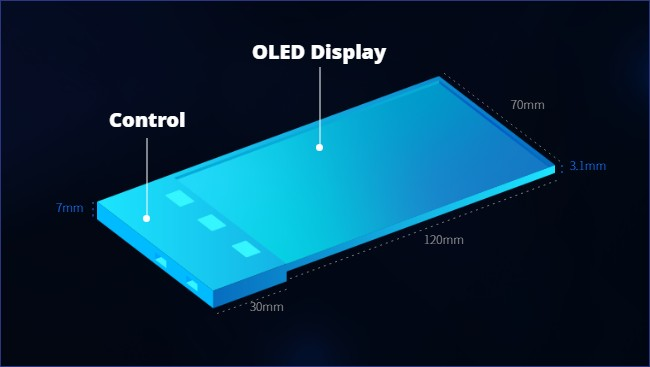

# ■ 휴대용 채굴기(NFT, 아이템, 코인 등)

### 1. 개요

* 특허 출원 신청 : 휴대용 NFT 하드월렛 플레이어 뷰어(2021년 11월)
* 명칭 : 게임 아이템채굴기기(하드웨어 및 소프트웨어로 구성)   &#x20;
* 하드웨어 개발 :  디스플레이 개발(5.4인치 OLED 디스플레이 +도킹바 )&#x20;
* 안드로이드 OS 개발
* 펌웨어개발&#x20;
* 핵심키워드 THIN (얇은 디스플레이 뷰어)&#x20;
* 휴대용 ITEM 마이닝 시스템 탑재

###

### 2. 스펙

1. OLED Display 4.97"\
   \- 1280 X 720 Real R.G.B\
   \- 16.7M Color\
   \- Touch panel\
   \- 120 X 70 X 3.1mm\

2. Main Control\
   \- 동영상및사진 재생기능    \
   \- 지문인식\
   \- 암호화 칩\
   \- Wifi 2.4Ghz, 5Ghz 및 Bluetooth 4.2\
   \- USB 2.0\
   \- 밧데리 내장

* 위 설계 및 스펙등은 개발 상황에 따라  다를 수 있습니다.         &#x20;

## 3. 기타

* 휴대용 채굴기 하드웨어에는 소프트웨어 월렛 개발 및 서비스가 탑재 됨
* 휴대용 채굴기 하드웨어와 소프트웨어의 싱크 및 연동 진행

### 4. Software Wallet

