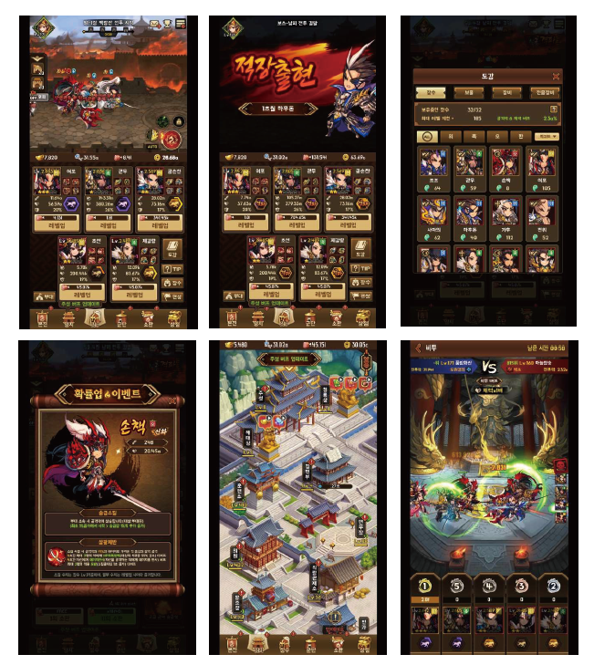
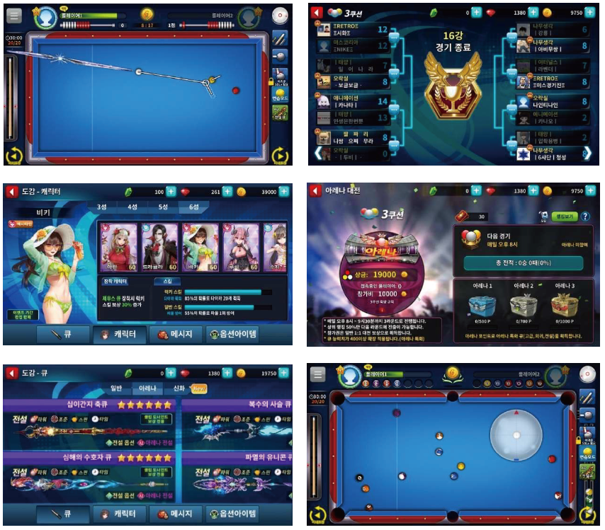

# ■ P2E

## 삼국지 카르마 리버스

#### 방치형 RPG로 Top class의 그래픽과 높은 완성도를 가진 삼국지 IP의 방치형 RPG&#x20;

**(국내 서비스 기간 동안 3,100원의 높은 ARPDAU 지표를 보여줌)**&#x20;

싱글플레이, PVP, 레이드 등 다양한 콘텐츠와 게임 요소를 가짐

장수와 세력, 무기와 방어구, 군마와 영지 수집/강화 등 P2E용 육성/파밍 요소 풍

**NFT:** 펫(군마), 장비(무기 및 방어구), 합성으로 신규 NFT 생성

**데모영상:  삼국지카르마**



&#x20;  &#x20;

## 당구의 신 리버스&#x20;

**한국에서 300만명 이상이 즐기는 No.1 당구 게임의 리버스**&#x20;

**(출시 첫해인 2016년 구글 플레이 올해를 빛낸 짜릿한 게임에 선정, 게임성 및 흥행성 공인)** &#x20;

Pocket ball (8, 9볼) 및 Carom 모드 (3구, 4구, 죽방) 등 다양한 게임 제공

e-Sports를 위한 다양한 기능 탑재 : 토너먼트, 관전, 베팅 등

**NFT:** 당구 큐, 캐릭터, 토너먼트 위닝샷 리플레이,  큐합성으로 신규 NFT 생성

**당구의신 데모영상 :**



