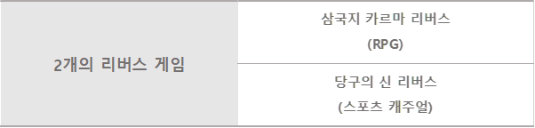

# ■ 목표

리트머스 얼라이언스의 풍부한 블록체인 경험과 함께 안드로메다게임즈의 성공 타이틀과 매력적인 신규 게임을 크립토토큰과 결합하여 재미와 높은 수익성을 지속적으로 보장하는 GameFi 제공

* **NFT Market 개발** \
  NFT 콘텐츠들을 사고 팔 수 있는 NFT 마켓을 개발 하도록 합니다.
* **P2E 게임 개발**
* **NFT 소프트 월렛 및 하드월렛 개발**
* **DEX 개발**

### 2년 동안 지속적으로 게임을 업데이하여 생태계 유지

* RPG, 스포츠 등의 다양한 믹스 제공
* 각 게임별 별도 코인 탑재, 다양한 NFT 아이템 업데이트로 게임의 재미 추구 외 수익 추구 기회를 지속적으로 제공

### 데모영상

### DAO 제안과 투표를 통한 향후 게임 추가   &#x20;

### SDK 제공

ITEM (ITEMVERSE Platform Token)과 / KARMA(삼국지 카르마 리버스 In-game 토큰) / CHALK(당구의 신리버스 In-game 토큰)를 사용 할 수 있는 SDK 제공하여  DAO 통한 외부 게임 연동 허용      &#x20;

### 투트 토큰 이코 노미 &#x20;

* ITEM: 메인 토큰으로 GameFi 직접 투자 및 NFT 구매/거래용, 최대 50억개 발행 예정
* KARMA/CHALK: In-game 토큰으로 게임내에서 획득하여 사용할 수 있는 발행량 무제한의 P2E 전용 토큰이며, 직접 또는 제작, 합 등을 통해 NFT화 되어 ITEM으로 교환

### NFT

* 게임 내의 캐릭터, 펫(군마), 장비(무기, 방어구, 당구큐), 주요장면 리플레이 등의 아이템을 NFT로 구현
* NFT는 ITEM으로 구매 및 거래 가능, ITEM과 KARMA/CHALK를 이용하여 제작, 진화, 합성으로 신규로 생성, KARMA/CHALK를 이용하여 강화, 레벨업

### 쉬운 사용을 위한 자체 거래 플랫폼 및 Wallet 제공

* NFT 거래용 자체 플랫폼 제공
* ITEM, KARMA/CHALK, NFT, 게임 계정 등을 통합하여 쉽게 관리할 수 있는 개인별 지갑 제공

