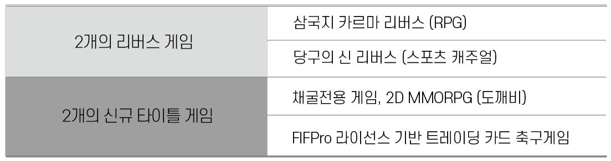

# 목표

리트머스 얼라이언스의 풍부한 블록체인 경험과 함께 안드로메다게임즈의 성공 타이틀과 매력적인 신규 게임을 크립토토큰과 결합하여 재미와 높은 수익성을 지속적으로 보장하는 GameFi 제공

* **NFT Market 개발** \
  NFT 콘텐츠들을 사고 팔 수 있는 NFT 마켓을 개발 하도록 합니다.
* **P2E 게임 개발**
* **NFT 소프트 월렛 및 하드월렛 개발**
* **DEX 개발**

### 5년 동안 지속적으로 게임을 공급하여 생태계 유지

* RPG, 스포츠, 퍼즐 등의 다양한 믹스 제공
* 게임의 재미 추구와 수익 추구를 구분하여 채굴 전문 게임 별도로 제공

### 데모영상

### DAO 제안과 투표를 통한 향후 게임 추가   &#x20;

### SDK 제공

ITEM (ITEMVERSE Platform Token)과 / 도깨비 파워를 사용 할 수 있는 SDK 제공하여  DAO 통한 외부 게임 연동 허용      &#x20;

### 2개의 토큰 이코 노미 &#x20;

* ITEM: 메인 토큰으로 GameFi 직접 투자 및 NFT 구매/거래용, 최대 50억개 발행 예정
* DKP: In-game 토큰으로 게임내에서 획득하여 사용할 수 있는 발행량 무제한의 P2E 전용 토큰이며, 직접 또는 제작, 교배 등을 통해 NFT화 되어 ITEM으로 교환

