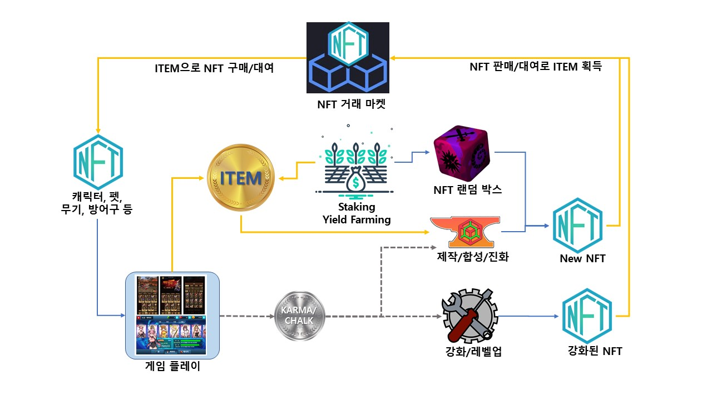

# ■ NFT

### 캐릭터, 장비(무기, 방어구, 당구큐), 펫(군마), 주요장면 리플레이 등의 게임 내의 각종 아이템을 NFT로 구현

**체인:** Binance Smart Chain (BSC)

#### NFT 아이템에 대한 ITEM, KARMA/CHALK 사용 용도

&#x20;\- ITEM을 이용하여 구매 및 거래 가능

&#x20;\- ITEM + KARMA/CHALK을 이용하여 제작, 합성, 진화

&#x20;\- KARMA/CHALK를 이용하여 강화 및 레벨업

#### &#x20;NFT 에코 시스템 정책

&#x20;\- 각 게임에만 사용하는 NFT와 모든 게임에서 사용할 수 있는 NFT 존재

&#x20;\- NFT 가차 박스: 모든 NFT를 얻을 수 있는 랜덤박스, Staking/Yield Farming 통해서 획득 가능

&#x20;\- NFT 생성기: 설계도에 맞는 NFT를 유저가 스스로 만들 수 있는 툴

&#x20;\- NFT 마켓 플레이스: Wallet과 통합된 NFT 거래소

### NFT와 FT의 상관 관계

