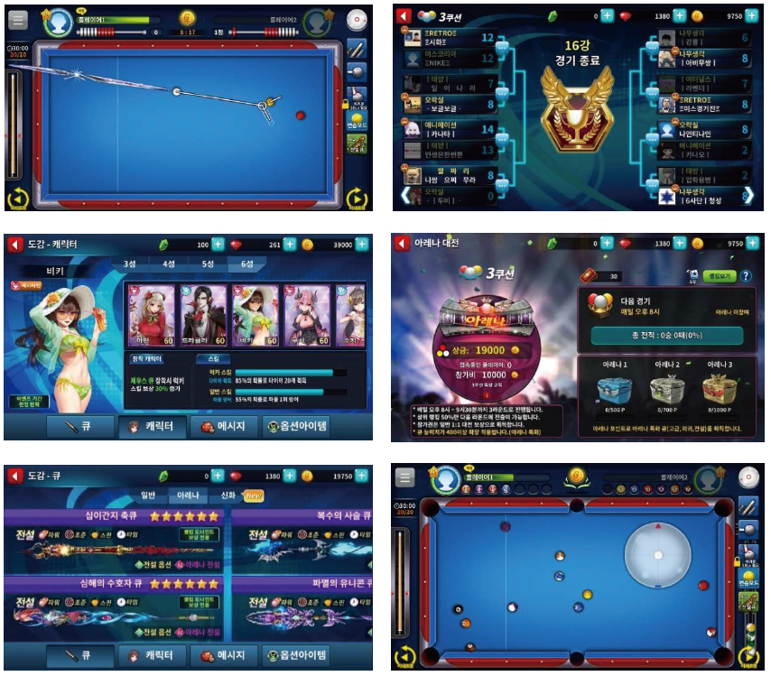

# 당구의 신

**한국에서 300만명 이상이 즐기는 No.1 당구 게임의 리버스**&#x20;

**(출시 첫해인 2016년 구글 플레이 올해를 빛낸 짜릿한 게임에 선정, 게임성 및 흥행성 공인)** &#x20;

Pocket ball (8, 9볼) 및 Carom 모드 (3구, 4구, 죽방) 등 다양한 게임 제공

e-Sports를 위한 다양한 기능 탑재 : 토너먼트, 관전, 베팅 등

**NFT:** 당구 큐, 캐릭터, 토너먼트 위닝샷 리플레이,  큐합성으로 신규 NFT 생성

**당구의신 데모영상 :**



